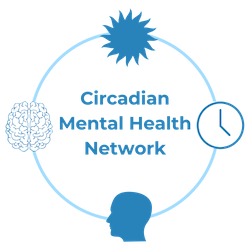

Welcome to the website of the **ENLIGHT Checklist**!

The ENLIGHT Checklist is the first consensus-based checklist for documenting and reporting ocular light-based interventions for human studies. They were developed with the input of international experts.

Downloads and links
===================

**[ENLIGHT Checklist](https://github.com/ENLIGHT-Project/ENLIGHT-Checklist/blob/06ee653046cffe833753028c2b4bc71cdb6a711b/1.0.2/ENLIGHT_Checklist_Release_1.0.2_20231016.pdf)** (v1.0.2, 16 October 2023)

**[ENLIGHT Explanation & Elaboration (E&E) document](https://github.com/ENLIGHT-Project/ENLIGHT-Checklist/blob/06ee653046cffe833753028c2b4bc71cdb6a711b/1.0.2/ENLIGHT_E%26E_Release_1.0.2_20231016.pdf)** (v1.0.2, 16 October 2023)

**[Publication](https://doi.org/10.1016/j.ebiom.2023.104889)** ([doi:10.1016/j.ebiom.2023.104889](https://doi.org/10.1016/j.ebiom.2023.104889))

Endorsing organisations
=======================

Support
==================

This project was made possible through the Network of European Institutes for Advanced Study (NetIAS) Constructive Advanced Thinking (CAT) programme.

Steering Committee
==================

**[Manuel Spitschan PhD](https://www.professoren.tum.de/en/spitschan-manuel)**, Technical University of Munich & Max Planck Institute for Biological Cybernetics

**[Laura Kervezee PhD](https://ccb.lumc.nl/research/circadian-clocks-99/laura-kervezee-374)**, Leiden University Medical Centre

**[Renske Lok PhD](https://profiles.stanford.edu/renske-lok)**, Stanford University

**[Elise McGlashan PhD](https://findanexpert.unimelb.edu.au/profile/1030083-elise-mcglashan)**, University of Melbourne

**[Raymond P. Najjar PhD](https://discovery.nus.edu.sg/9565-raymond-najjar)**, National University of Singapore

Contact
=======

For any questions, please reach out to [Manuel Spitschan PhD](mailto:manuel.spitschan@tum.de).
